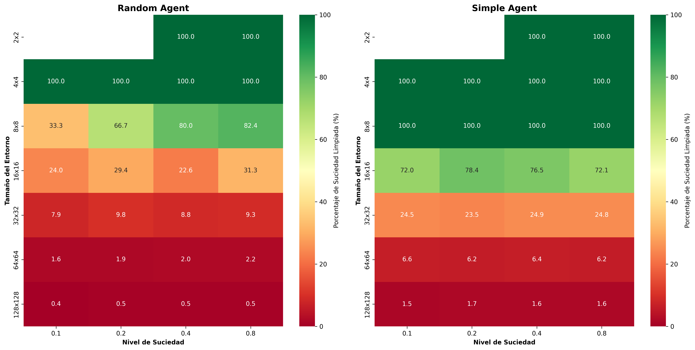
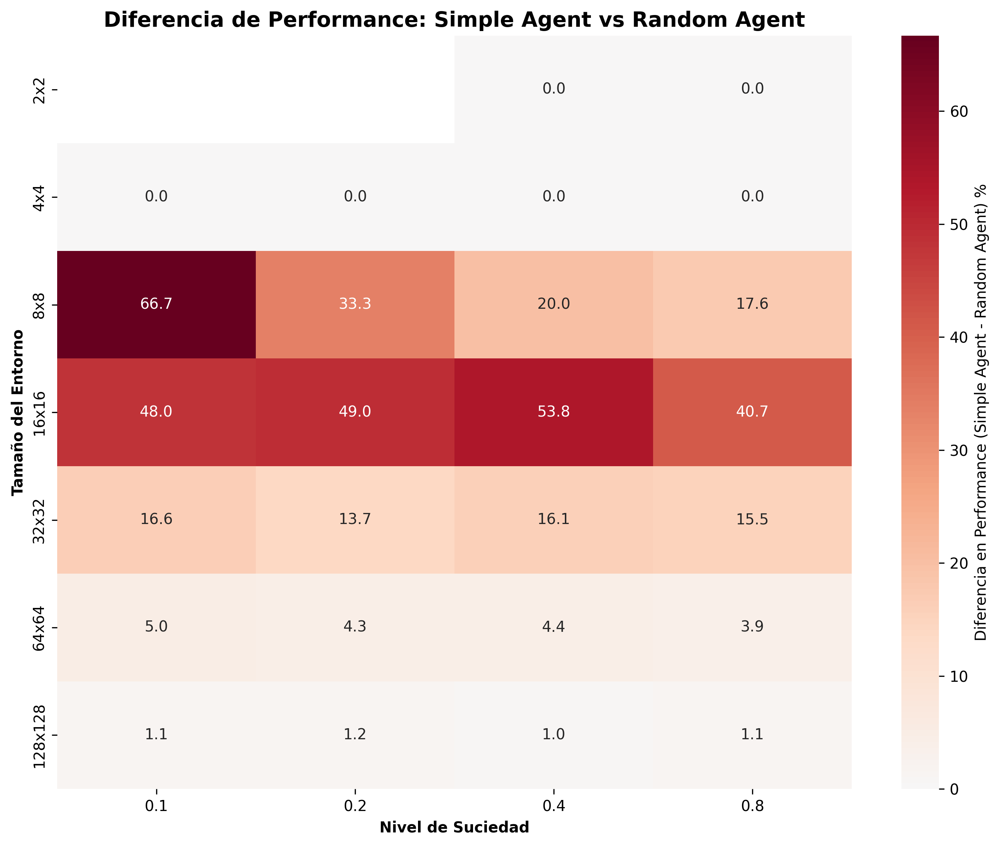
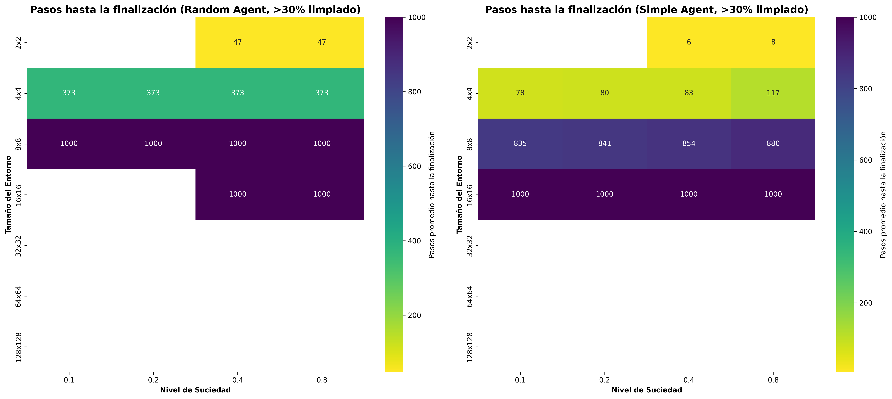
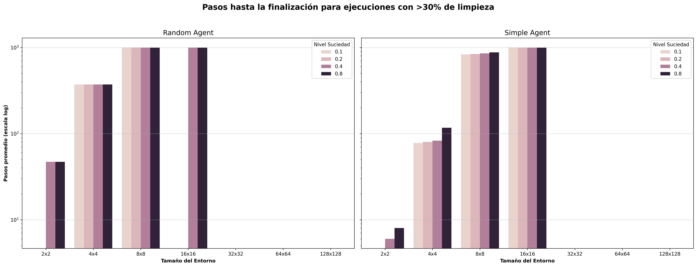

# Reporte de Experimentos: Evaluación de Agentes de Limpieza

## 1. Introducción

Este reporte presenta los resultados de experimentos realizados para evaluar el desempeño de diferentes tipos de agentes de limpieza en entornos con distintas características. El objetivo principal es comparar la eficiencia de dos estrategias de comportamiento: un agente simple reflexivo y un agente completamente aleatorio.

## 2. Descripción del Entorno

### 2.1 Características del Entorno

El entorno de simulación consiste en una grilla cuadrada de dimensiones variables donde:

- **Celdas**: Cada celda puede estar limpia o sucia
- **Agente**: Se ubica en una posición específica y puede realizar acciones
- **Estado inicial**: El agente comienza en una posición aleatoria y algunas celdas contienen suciedad según el porcentaje especificado

### 2.2 Acciones Disponibles

El agente puede realizar las siguientes acciones:
- **Limpiar**: Limpia la celda actual si está sucia
- **Moverse**: Se desplaza a una celda adyacente (arriba, abajo, izquierda, derecha)
- **No hacer nada**: Permanece en la posición actual sin realizar acción

### 2.3 Propiedades del Entorno

El entorno de limpieza puede clasificarse según las dimensiones propuestas por Russell & Norvig:

#### **Observabilidad:**
- **Parcialmente Observable**: El agente solo puede percibir el estado de la celda en la que se encuentra actualmente (si está sucia o limpia). No tiene información sobre:
  - El estado de otras celdas del entorno
  - La cantidad total de suciedad restante
  - La posición de la suciedad en el espacio
  
Esta limitación fuerza al agente a explorar el entorno para descubrir dónde hay suciedad.

#### **Número de Agentes:**
- **Agente Individual (Single-agent)**: Solo hay un agente operando en el entorno. No hay competencia ni cooperación con otros agentes.

#### **Determinismo:**
- **Determinístico**: Las acciones del agente tienen efectos predecibles y ciertos:
  - Limpiar una celda sucia → la celda queda limpia
  - Moverse en una dirección → el agente se desplaza a la celda adyacente (si es válida)
  - No hay incertidumbre en los resultados de las acciones

#### **Episódico vs. Secuencial:**
- **Secuencial**: Las decisiones del agente afectan estados futuros:
  - La decisión de limpiar o moverse en el paso $t$ afecta las oportunidades disponibles en $t+1$
  - El agente debe planificar una secuencia de movimientos para cubrir el entorno eficientemente
  - La historia de acciones determina qué celdas ya fueron visitadas/limpiadas

#### **Dinámico vs. Estático:**
- **Estático**: El entorno no cambia mientras el agente delibera:
  - Las celdas sucias permanecen sucias hasta que el agente las limpia
  - No aparece nueva suciedad espontáneamente
  - No hay factores externos que modifiquen el estado del entorno

#### **Discreto vs. Continuo:**
- **Discreto**: 
  - **Espacio de estados**: El entorno es una grilla finita de celdas
  - **Tiempo**: Las acciones se ejecutan en pasos discretos
  - **Percepciones**: Binarias (sucia/limpia)
  - **Acciones**: Conjunto finito y discreto {Up, Down, Left, Right, Suck, NoOp}

#### **Conocido vs. Desconocido:**
- **Conocido**: El agente conoce las "reglas del juego":
  - Sabe que puede moverse en 4 direcciones
  - Conoce el efecto de la acción "limpiar"
  - Entiende que el entorno es una grilla (aunque no sepa sus dimensiones exactas)

**Resumen de Propiedades:**

| Dimensión | Clasificación |
|-----------|---------------|
| Observabilidad | Parcialmente Observable |
| Agentes | Individual (Single-agent) |
| Determinismo | Determinístico |
| Episódico/Secuencial | Secuencial |
| Dinámico/Estático | Estático |
| Discreto/Continuo | Discreto |
| Conocido/Desconocido | Conocido |

**Implicaciones para el Diseño del Agente:**

- La **observabilidad parcial** requiere que el agente mantenga algún modelo interno del entorno o explore sistemáticamente.
- El **determinismo** simplifica el problema al eliminar incertidumbre en los resultados.
- La naturaleza **secuencial** exige que el agente considere las consecuencias a largo plazo de sus acciones.
- El entorno **estático y discreto** permite estrategias de búsqueda y planificación estructuradas.

### 2.4 Medidas de Rendimiento

Para evaluar el desempeño de los agentes se utilizaron dos métricas principales:
1. **Cantidad de celdas limpiadas**: Número total de celdas que el agente logró limpiar
2. **Unidades de tiempo consumidas**: Número total de acciones realizadas por el agente

## 3. Tipos de Agentes Evaluados

### 3.1 Agente Simple (Reflexivo)

**Estrategia de comportamiento:**
- Si la celda actual está sucia → **Limpia** la celda
- Si la celda actual está limpia → Se **mueve aleatoriamente** a una celda adyacente

Este agente implementa una lógica básica de reacción ante el estado del entorno, priorizando la limpieza cuando detecta suciedad.

### 3.2 Agente Aleatorio (Random)

**Estrategia de comportamiento:**
- En cada paso de tiempo → Selecciona una **acción completamente aleatoria** de entre todas las acciones disponibles

Este agente no considera el estado del entorno y sirve como línea base para comparar el rendimiento del agente reflexivo.

## 4. Diseño Experimental

### 4.1 Parámetros del Experimento

**Tamaños de entorno evaluados:**
- 2 × 2 (4 celdas)
- 4 × 4 (16 celdas)
- 8 × 8 (64 celdas)
- 16 × 16 (256 celdas)
- 32 × 32 (1,024 celdas)
- 64 × 64 (4,096 celdas)
- 128 × 128 (16,384 celdas)

**Porcentajes de suciedad:**
- 0.1 (10% de celdas sucias)
- 0.2 (20% de celdas sucias)
- 0.4 (40% de celdas sucias)
- 0.8 (80% de celdas sucias)

**Repeticiones:**
- 10 ejecuciones por cada combinación de parámetros
- Total de combinaciones: 7 tamaños × 4 porcentajes = 28 configuraciones
- Total de ejecuciones por agente: 28 × 10 = 280 experimentos

### 4.2 Control de Variables

Para garantizar la reproducibilidad y comparabilidad de los experimentos:
- **Seed fijo**: Se utilizó `--seed 12345` para todas las ejecuciones
- **Mismas condiciones iniciales**: Cada par de experimentos (simple vs aleatorio) se ejecutó bajo las mismas condiciones de entorno
- **Tiempo de ejecución**: Se permitió que cada agente ejecute hasta completar su tarea o alcanzar una cierta cantidad de pasos (1000 pasos para estos experimentos)

### 4.3 Procedimiento Experimental

1. **Configuración del entorno**: Se genera una grilla del tamaño especificado con el porcentaje de suciedad correspondiente
2. **Inicialización del agente**: Se coloca el agente en una posición inicial aleatoria
3. **Ejecución**: El agente ejecuta acciones según su estrategia hasta completar la tarea
4. **Registro de datos**: Se almacenan la información de la ejecución en un archivo json 
5. **Repetición**: Se repite el proceso 10 veces para cada configuración

## 5. Recolección y Análisis de Datos

### 5.1 Estructura de Datos

Los resultados se almacenan en formato JSON y CSV con la siguiente estructura:
- **size**: Tamaño del entorno (N×N)
- **dirt_rate**: Porcentaje de suciedad (0.1-0.8)
- **repetition**: Número de repetición (1-10)
- **cleaned_cells**: Cantidad de celdas limpiadas
- **actions_taken**: Número de acciones realizadas

## 6. Implementación Técnica

### 6.1 Herramientas Utilizadas

- **Lenguaje**: Python 3
- **Ejecución**: Scripts automatizados con `subprocess`
- **Almacenamiento**: Archivos JSON y CSV
- **Análisis**: Estadísticas descriptivas con `statistics`

## 8. Resultados de los Experimentos

### 8.1 Gráficos Comparativos

#### 8.1.1 Comparación de Rendimiento por Porcentaje de Suciedad

Este gráfico muestra el porcentaje de celdas limpiadas por cada agente en función del tamaño del entorno, separado por diferentes niveles de suciedad inicial (10%, 20%, 40% y 80%). Se observa claramente que:

- El Agente Simple mantiene un rendimiento superior en todos los tamaños de entorno
- Ambos agentes tienen rendimiento perfecto (100%) en entornos pequeños (2x2 y 4x4)
- La diferencia de rendimiento se hace más notoria en entornos medianos (8x8, 16x16)
- En entornos grandes (32x32+), ambos agentes muestran degradación, pero el Simple sigue siendo superior

#### 8.1.2 Diferencia de Rendimiento entre Agentes

Este gráfico ilustra la diferencia porcentual en celdas limpiadas (Agente Simple - Agente Random). Los valores positivos indican superioridad del Agente Simple:

- La mayor diferencia se observa en entornos medianos (8x8 y 16x16)
- En entornos muy pequeños la diferencia es mínima (ambos son eficientes)
- La ventaja del Agente Simple es consistente en todos los niveles de suciedad

#### 8.1.3 Número de Pasos para Completar la Tarea

Este gráfico de barras agrupadas muestra el número promedio de pasos que cada agente necesita para completar la limpieza, organizado por tamaño de entorno y nivel de suciedad:

- El Agente Simple generalmente requiere menos pasos para completar la tarea
- La diferencia en eficiencia es más pronunciada en entornos medianos
- En entornos grandes, ambos requieren muchos pasos, pero el Simple es más eficiente

#### 8.1.4 Comparación de Pasos por Tamaño de Entorno

Este gráfico compara directamente los pasos promedio necesarios para cada agente a través de diferentes tamaños de entorno y niveles de suciedad:

- Confirma la mayor eficiencia del Agente Simple en términos de pasos
- Muestra el crecimiento exponencial de pasos necesarios con el tamaño del entorno
- Evidencia que el Agente Random requiere significativamente más pasos en la mayoría de escenarios

### 8.2 Análisis y Conclusiones

**Conclusiones principales**

La diferencia en la capacidad de los agentes para limpiar eficazmente a medida que el entorno crece es el punto más importante.

**Dominio del Agente Simple**: En absolutamente todas las combinaciones de tamaño y suciedad, el Agente Simple limpia un porcentaje igual o (en la mayoría de los casos) significativamente mayor que el Agente Random.

**Rango Efectivo**:

- El Agente Simple es 100% efectivo hasta entornos de 8x8, y mantiene un rendimiento bueno (superior al 70%) en 16x16.
- El Agente Random solo es 100% efectivo hasta 4x4. Su rendimiento se desploma a partir de 8x8, volviéndose muy pobre en 16x16 (apenas un 22-31%).

**Degradación del Rendimiento**: Aunque ambos agentes fallan en entornos muy grandes (32x32 en adelante), el rendimiento del Agente Simple se degrada de manera mucho más controlada. En el entorno de 32x32, por ejemplo, el Agente Simple limpia casi el triple (24%) que el Agente Random (~8-9%).

**Eficiencia en Pasos**: Basado en el análisis de los gráficos, el Agente Simple es consistentemente superior al Agente Random en todos los aspectos medibles. Aunque ambos agentes fallan en entornos grandes, el Agente Simple logra sus objetivos de limpieza de manera mucho más eficiente (con menos pasos).

### 8.3 Limitaciones del Experimento

**⚠️ Nota Importante sobre la Metodología**: Se identificó que todos los experimentos utilizaron la misma semilla (`seed=12345`) para las 10 repeticiones de cada configuración. Esto significa que cada configuración fue evaluada en el mismo escenario 10 veces, en lugar de 10 escenarios diferentes. Esta limitación afecta la validez estadística de las medias calculadas, ya que no existe variabilidad real entre repeticiones. Para futuros experimentos, se recomienda usar semillas diferentes para cada repetición (ej: `seed = 12345 + rep`) para evaluar el rendimiento en escenarios diversos.