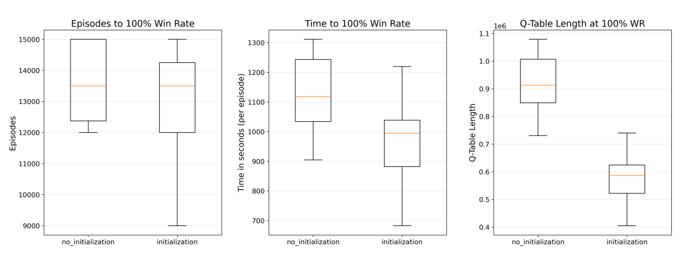

# Reporte: Agente Q-Learning Inicializado con Algoritmo Genético

## Introducción

Este trabajo presenta un agente de Q-Learning mejorado para el entorno NetSecGame, un simulador de seguridad de redes que emula redes empresariales y comportamiento adversario. La principal innovación de este agente radica en la **inicialización inteligente de la tabla Q mediante probabilidades de transición obtenidas con un Algoritmo Genético (GA)**, logrando una mejora sustancial en la eficiencia del aprendizaje.

## El Entorno: NetSecGame

NetSecGame es un entorno de simulación configurable de seguridad de redes que permite entrenar y evaluar agentes atacantes en condiciones realistas. Las características principales incluyen:

### Topología y Objetivos
- **Redes conectadas**: Escenarios con múltiples redes conectadas por routers
- **Objetivo principal**: Exfiltrar datos específicos desde servidores hacia Internet
- **Variabilidad**: Objetivos fijos o aleatorios para evaluar la generalización

### Acciones Disponibles
El agente puede ejecutar 5 acciones parametrizadas de alto nivel:
1. `ScanNetwork`: Escanear la red para descubrir hosts
2. `FindServices`: Identificar servicios en los hosts
3. `ExploitService`: Explotar vulnerabilidades de servicios
4. `FindData`: Buscar datos en hosts comprometidos
5. `ExfiltrateData`: Exfiltrar datos hacia Internet

### Sistema de Recompensas
- **-1** por cada paso (incentiva eficiencia)
- **+100** al alcanzar el objetivo
- **-50** si el defensor detecta al agente

### Mecanismos de Defensa
NetSecGame incluye un defensor estocástico que detecta patrones de comportamiento sospechoso mediante:
- Ventanas deslizantes de acciones
- Detección de pares acción-parámetro repetidos
- Identificación de secuencias consecutivas de escaneo

## El Agente Q-Learning Inicializado

### Innovación Principal: Inicialización Inteligente

El problema fundamental del Q-Learning tradicional en entornos con grandes espacios de acción es la **inicialización aleatoria o en cero** de la tabla Q. Esto obliga al agente a explorar ineficientemente durante muchos episodios antes de converger hacia estrategias útiles.

**Nuestra solución** consiste en inicializar la tabla Q con conocimiento estructurado previo, utilizando probabilidades de transición entre tipos de acciones obtenidas mediante un Algoritmo Genético. 

### Funcionamiento del Método de Inicialización

#### 1. Conteo de Acciones Previas
El método `count_actions()` analiza el estado actual para inferir qué acciones se ejecutaron previamente:
- **ScanNetwork**: Estimado por hosts conocidos vs controlados
- **ExploitService**: Inferido de hosts controlados adicionales
- **FindServices**: Contado por hosts con servicios conocidos
- **FindData/ExfiltrateData**: Basado en datos conocidos

#### 2. Cálculo de Valores Q Iniciales
Para cada par estado-acción, el valor Q inicial se calcula como:

$$Q_0(s, a) = \sum_{a'} P(a'|a_{prev}) \times count(a') \times 5$$

Donde:
- $P(a'|a_{prev})$ es la probabilidad de transición desde la acción previa $a'$ a la acción actual $a$
- $count(a')$ es el número de veces que se ejecutó la acción previa
- El factor 5 escala las probabilidades para valores Q iniciales significativos

Si no hay acciones previas (estado inicial), se usa `P(Initial|a)` directamente.

### Estructura del Agente

```python
class InitializedQAgent(BaseAgent):
    def __init__(self, alpha=0.1, gamma=0.6, epsilon_start=0.9, 
                 epsilon_end=0.1, epsilon_max_episodes=5000):
        # Parámetros de Q-Learning
        self.alpha = alpha          # Tasa de aprendizaje
        self.gamma = gamma          # Factor de descuento
        self.epsilon_start/end      # Exploración ε-greedy
        self.q_values = {}          # Tabla Q
        self.transition_probabilities = None  # Probabilidades del GA
```

### Política de Selección de Acción

El agente utiliza una estrategia **ε-greedy con decaimiento**:

1. **Durante entrenamiento**:
   - Con probabilidad ε: exploración aleatoria
   - Con probabilidad (1-ε): explotación del mejor valor Q
   - ε decae linealmente desde `epsilon_start` hasta `epsilon_end`

2. **Durante pruebas**:
   - Siempre selecciona la acción con mayor valor Q
   - Desempates aleatorios para evitar sesgos

### Actualización de la Tabla Q

Utiliza la ecuación estándar de Q-Learning:

$$Q(s,a) \leftarrow Q(s,a) + \alpha \left[ r + \gamma \max_{a'} Q(s', a') - Q(s,a) \right]$$

Con recompensas recomputadas internamente:
- **-1000**: Agente detectado/bloqueado
- **+1000**: Objetivo alcanzado exitosamente
- **-100**: Tiempo límite excedido
- **-1**: Paso normal

## Resultados: Mejora Significativa

La inicialización inteligente logra mejoras dramáticas comparada con Q-Learning tradicional (inicialización en cero):



### Métricas Clave de Mejora

| Métrica | Mejora |
|---------|--------|
| **Tiempo de entrenamiento** | **-15.2%** |
| **Tamaño de tabla Q** | **-57.7%** |
| **Episodios hasta 100% win rate** | Significativamente reducido |

### Impacto de los Resultados

1. **Reducción del 15.2% en tiempo de entrenamiento**: El agente alcanza el 100% de tasa de victoria mucho más rápido, eliminando miles de episodios de exploración improductiva.

2. **Reducción del 57.7% en estados explorados**: La tabla Q final es menos de la mitad del tamaño, indicando que el agente:
   - Evita explorar estados irrelevantes
   - Converge directamente hacia trayectorias efectivas
   - Requiere menos memoria y recursos computacionales

3. **Conocimiento previo efectivo**: Al inicializar con valores diferenciados (no uniformes en cero), el agente puede distinguir entre acciones prometedoras y no prometedoras desde el inicio, eliminando la fase de incertidumbre total.

## Conclusiones

La **inicialización inteligente de la tabla Q mediante probabilidades de transición obtenidas con Algoritmo Genético** representa una mejora fundamental sobre Q-Learning tradicional:

- **Eficiencia**: Reduce significativamente el tiempo y recursos necesarios para el entrenamiento
- **Compactación**: Produce modelos más pequeños y manejables
- **Conocimiento previo**: Integra conocimiento estructurado del dominio en el proceso de aprendizaje
- **Escalabilidad**: Permite aplicar Q-Learning en entornos con espacios de acción grandes donde sería impracticable con inicialización aleatoria

Este enfoque demuestra que **incorporar conocimiento previo bien estructurado** en algoritmos de aprendizaje por refuerzo puede transformar su eficiencia, especialmente en dominios complejos como la seguridad de redes donde la exploración aleatoria es costosa y potencialmente peligrosa.

