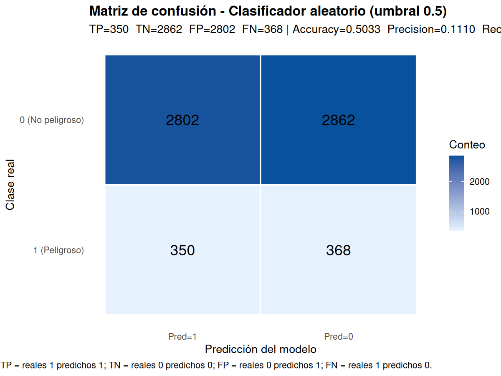
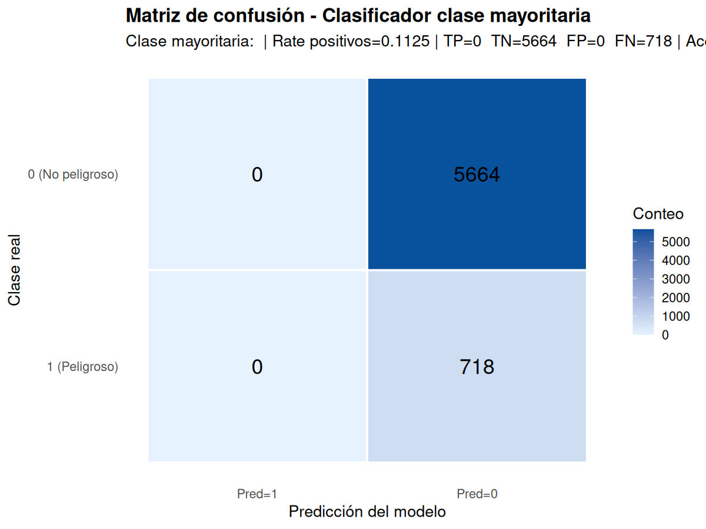

# TP7B - Clasificadores base

Este documento presenta los clasificadores base (aleatorio y mayoritario) y sus métricas.

## Metodología

- `random_classifier`: generamos una columna `prediction_prob` con valores uniformes U(0,1) (seed reproducible) y clasificamos con umbral 0.5.
- `biggerclass_classifier`: siempre predice la clase mayoritaria observada en el conjunto.

## Matrices de confusión (figuras)

- `random_classifier_confusion_matrix.png`
- `majority_classifier_confusion_matrix.png`

## Tabla de métricas

Los resultados que se incluyen provienen de `metrics_summary.csv` (resumen ya calculado) — se muestran las métricas centrales para el conjunto evaluado:

| Model | N | TP | TN | FP | FN | Accuracy | Precision | Sensitivity | Specificity |
|---|---:|---:|---:|---:|---:|---:|---:|---:|---:|
| Random (0.5) | 6382 | 350 | 2862 | 2802 | 368 | 0.50329 | 0.11104 | 0.48747 | 0.50530 |
| Mayoritaria | 6382 | 0 | 5664 | 0 | 718 | 0.88750 | NA | 0.00000 | 1.00000 |

Interpretación rápida:
- El clasificador mayoritario tiene alta Accuracy debido al desbalance (clase 0 muy frecuente), pero Sensitivity = 0 (no detecta positivos) y Precision indefinida (NA) por falta de predicciones positivas.
- El clasificador aleatorio tiene Accuracy cercana a 0.5 como cabría esperar y baja Precision.

## Reproducir en R

Use el script `code/eda-clasif-cv/eda_clasif_cv.R`:
- `add_random_probs()` para añadir `prediction_prob` (parámetro `seed` disponible)
- `random_classifier()` y `biggerclass_classifier()` para obtener `prediction_class`
- `confusion_counts()` y `compute_metrics()` para obtener las métricas

