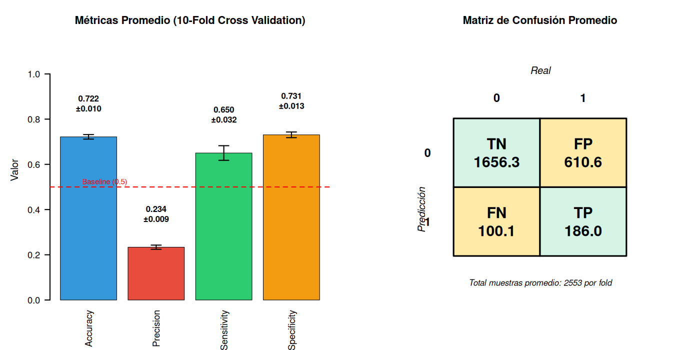

# TP7B - Validación cruzada (k-fold)

Este documento describe la función de validación cruzada utilizada y resume los resultados.

## Implementación

En `code/eda-clasif-cv/eda_clasif_cv.R` se implementan:

- `create_folds(df, k, seed, stratify_by = NULL)` — crea índices de k folds; si `stratify_by` se suministra, hace particionado estratificado por esa columna.
- `cross_validation(df, formula, k, seed, control, stratify = TRUE)` — entrena un `rpart` en cada fold, predice probabilidades y devuelve métricas por fold y un resumen (media y sd).

Fragmento (resumen de las funciones, ver el script para detalles):

```r
folds <- create_folds(df, k = 5, seed = 2025, stratify_by = "inclinacion_peligrosa")
cv_res <- cross_validation(df, formula = inclinacion_peligrosa ~ circ_tronco_cm + especie + area_seccion, k = 5, seed = 2025)
print(cv_res$summary)
```

## Resultados (resumen)

Valores extraídos de `cv_summary.csv`:

| Metric | Mean | SD |
|---|---:|---:|
| Accuracy | 0.7216214 | 0.01005533 |
| Precision | 0.2335707 | 0.00923265 |
| Sensitivity | 0.6501157 | 0.03234922 |
| Specificity | 0.7306451 | 0.01252260 |

Interpretación:
- El árbol con las variables propuestas entrega una Accuracy promedio ~0.72.
- Sensitivity ~0.65 indica que detecta alrededor del 65% de inclinaciones peligrosas en promedio.

## Figuras

- `cv_results_plot.png` contiene la visualización de métricas por modelo/porcentaje (si fue generada). Incluida en el repositorio.




## Cómo ejecutar / reproducir

1. Abrir R y cargar tidyverse/rpart.
2. Cargar datos desde `data/arbolado-mendoza-dataset-train.csv`.
3. Ejecutar los ejemplos en `code/eda-clasif-cv/eda_clasif_cv.R`.


---

Si quiere, puedo ejecutar el CV directamente aquí (usar R) y adjuntar los outputs/per-fold completos o actualizar los CSVs de resultados. Dime si quieres que ejecute el CV ahora con k=5 y guarde `cv_fold_results.csv` y `cv_summary.csv` actualizados.
