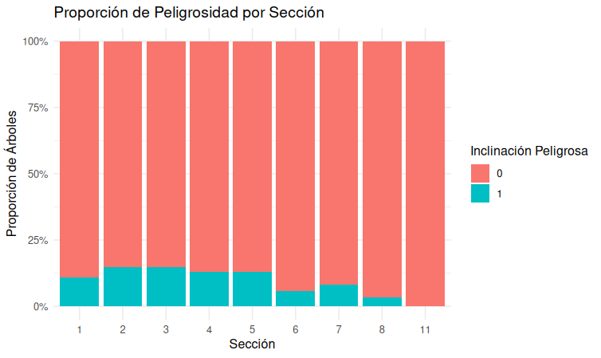
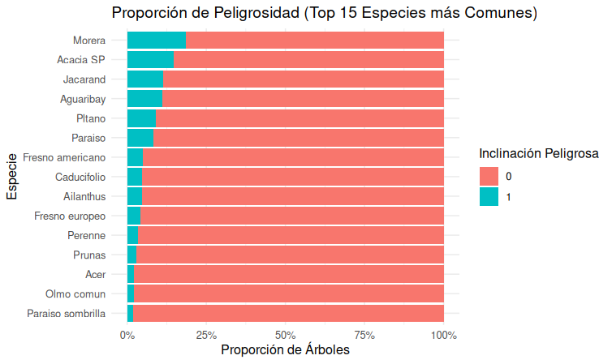
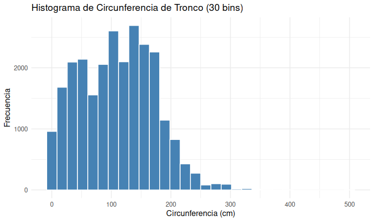
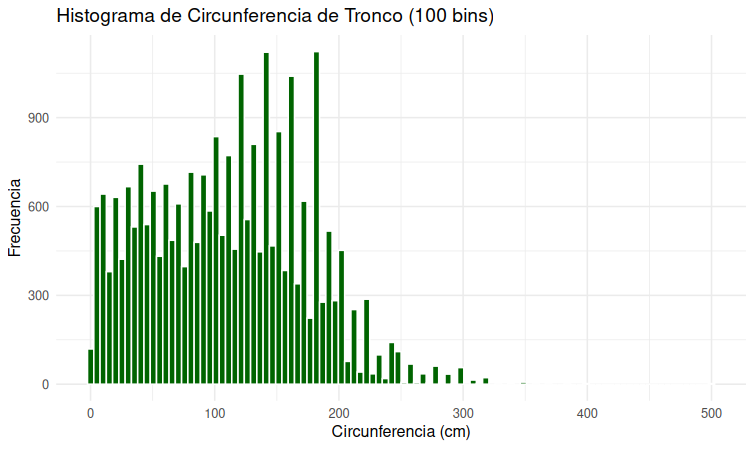
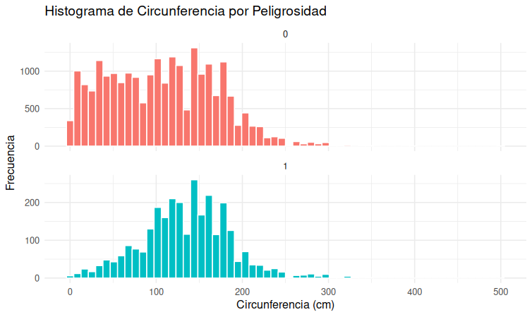

# TP7B - EDA

Este documento resume el EDA solicitado (preguntas 2a-2c) y contiene las figuras generadas.

## 2a) ¿En qué secciones hay más árboles con inclinación peligrosa?

Ver figura: `images/peligrosidad_por_seccion.png` (ya incluida en el repositorio). Esta gráfica muestra el conteo de árboles con `inclinacion_peligrosa == 1` por `nombre_seccion`.

Observación: las secciones con mayores conteos pueden indicar zonas con necesidad de inspección.

## 2b) ¿Qué especies son las más afectadas por la inclinación peligrosa?

Ver figura: `images/pligrosidad_especie.png` (barras por especie mostrando proporción / conteo de inclinación peligrosa).

Observación: algunas especies muestran mayor proporción de inclinaciones peligrosas; conviene filtrar por abundancia para no sobre-interpretar especies escasas.

## 2c) Histograma de circunferencia segmentado por `inclinacion_peligrosa`

Se incluyen los histogramas y variantes:

- `images/circunferencia_30.png` — histograma con bins pequeñas
- `images/circunferencia_100_bins.png` — histograma con 100 bins
- `images/circ_peligrosidad.png` — densidad por clase

La variable `circ_tronco_cm` también fue categorizada en 4 niveles (`bajo`, `medio`, `alto`, `muy alto`) y se guardó en el archivo de entrenamiento: `data/arbolado-mendoza-dataset-circ_tronco_cm-train.csv`.

**Notas sobre reproducibilidad**

- Los CSV principales se encuentran en `data/`.
- Para reproducir las figuras, ejecutar el script R en `code/eda-clasif-cv/eda_clasif_cv.R` y adaptar los snippets de plotting según librerías de preferencia.
